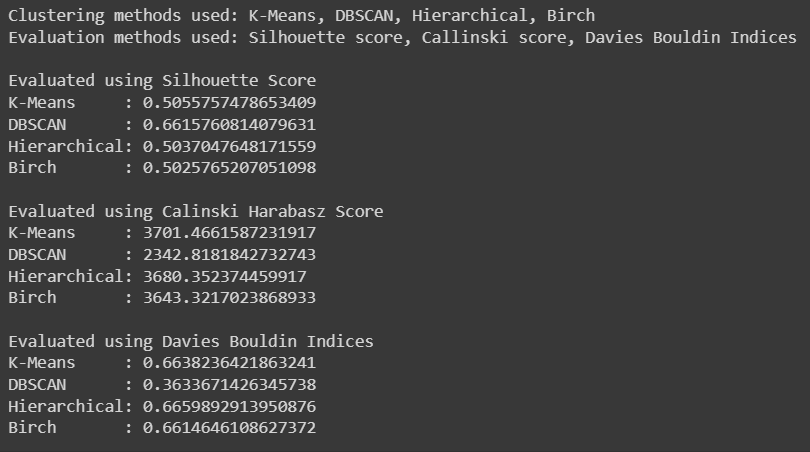

# Fundamentals of Data Science
## Jessica Angela Huang - 2602213031 - L3BC
### Summary for each algorithm used:
#### a. K-Means: groups data into 'k' clusters based on the average position of points
#### b. DBSCAN (Density-Based Spatial Clustering of Applications with Noise): finds clusters by looking at how densely packed points are. 
#### c. Hierarchical Clustering: organizes data into a tree of clusters. It's flexible for different cluster shapes and can show relationships between clusters in a tree diagram.
#### d. BIRCH (Balanced Iterative Reducing and Clustering using Hierarchies): BIRCH is good for large datasets. It builds a tree of clusters gradually and works well with different types of clusters and high-dimensional data.

